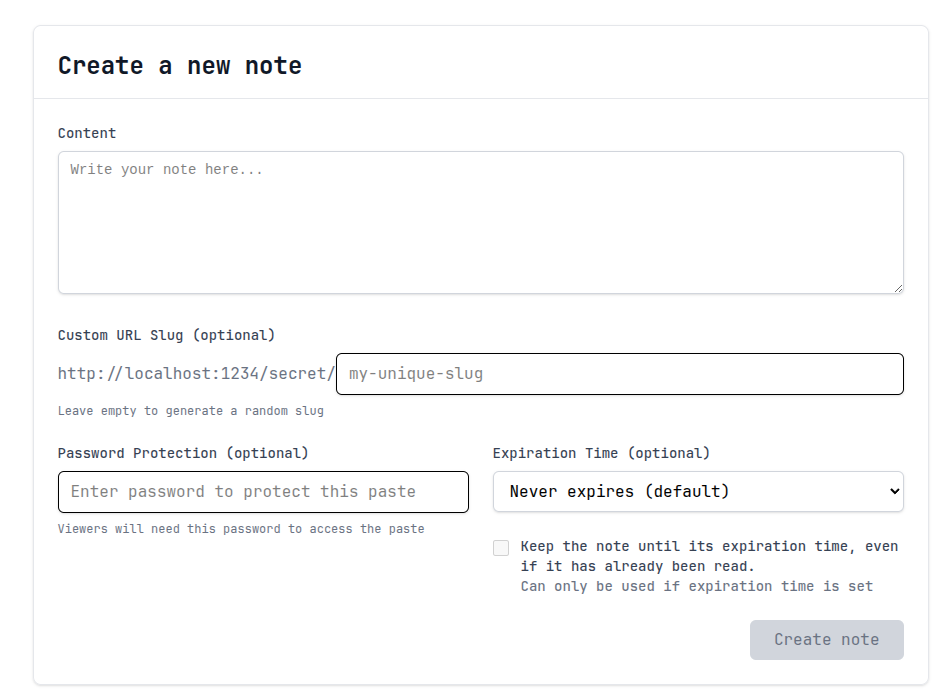

# Onasty

Full-stack application for temporary note staring with automatic deletion after being read or upon expiration.

## Features
- 🔑 **Auth:** OAuth2 + JWT authentication.
- 📧 **Account confirmation:** Email verification for new users.
- 🔒 **Password protection:** Secure notes with a password.
- 📝 **Custom slugs:** Choose your own note URL.
- 👤 **Optional accounts:** Create an account to manage your notes, or use it anonymously.
- 🚦 **Rate limiting:** Protects API from abuse.
- ⏳ **Editable notes:** Change content or expiration time if the note hasn’t been read yet.

## 📖 Usage
1. Visit the frontend at `<your hosted url>`(there's no hosted app, yet).
2. Create a note → get a unique link.
3. Share the link — once opened, the note is gone.

## 📚 Documentation
Documentation on project and how to develop it lives [here](/docs)
